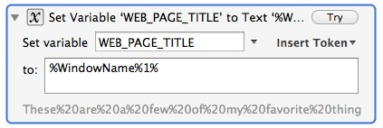
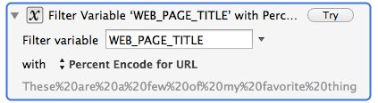
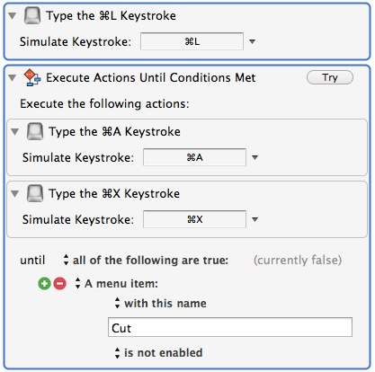
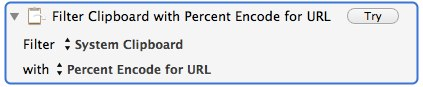
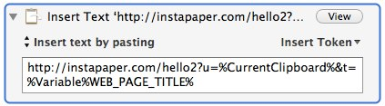
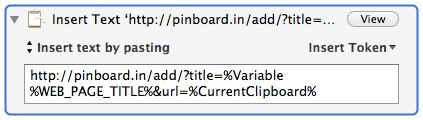
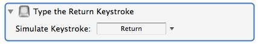

km-pinboard-instapaper-without-javascript
=========================================

**TL;DR Summary:** How to send a web browser's current URL to [Pinboard][1] or [Instapaper][2] without JavaScript

I have created a [Fluid.app][3] browser which receives all my links from [Tweetbot][4] thanks to a [Choosy][5] rule.

This Fluid browser sets its User Agent to iPhone and has plugins and JavaScript disabled. Why? Because too many sites cannot be trusted with either of the latter, and the iPhone User Agent gets the mobile version of most sites, which is generally less cluttered.

The only problem with this is that I cannot use bookmarklets when JavaScript is disabled, so I cannot send links to Pinboard and Instapaper. 

Well… not easily. 

I mean, I *could* do it if I was willing to manually copy the `<title>` of the webpage and the URL, encode them both, and then manually add the necessary parts of the URLs. This is not complicated; all you have to do is use

		http://instapaper.com/hello2?u=$URL&t=$TITLE

and

		http://pinboard.in/add/?url=$URL&title=$TITLE

where `$URL` and `$TITLE` are the _properly encoded_ versions of each, but it's hardly _convenient_ to do so.

Tedious and repetitious? You know what that means: *time for automation.*

### Enter Keyboard Maestro ###

[Keyboard Maestro][6] can get the title of the current webpage quite easily, since web browsers use the `<title>` of the webpage as the title of their window.

*	Keyboard Maestro stores the window title information as `%WindowName%1%` so all we need to do is store it in a variable using Keyboard Maestro's "Set Variable to Text" action.

*	Now we need to encode that variable for use in an URL. Keyboard Maestro can do this with its "Filter Variable" action if we choose "Percent Encode for URL"

*	With that information stored away, we now grab the URL. To do so, we’ll use a few keyboard shortcuts, namely <kbd>⌘</kbd> + <kbd>L</kbd> to jump to the address field, followed by <kbd>⌘</kbd> + <kbd>A</kbd> to Select All, and then <kbd>⌘</kbd> + <kbd>X</kbd> to *cut* the selected text. That will put the URL into the system clipboard. (Note that for some reason this doesn’t always work on the first try, so we’ll repeat <kbd>⌘</kbd> + <kbd>A</kbd> and  <kbd>⌘</kbd> + <kbd>X</kbd> in a loop which won’t stop until the menu item for "Cut" is disabled, since that will only happen when we know that we have successfully ‘cut’ the URL.)

*	We need to do the same encoding as before, except this time on the system clipboard.

* 	All of the pieces are ready, so we just have to assemble them.
	* 	For Instapaper:
		* 	`http://instapaper.com/hello2?u=%CurrentClipboard%&t=%Variable%WEB_PAGE_TITLE%`
	

	*	For Pinboard:

		*	`http://pinboard.in/add/?title=%Variable%WEB_PAGE_TITLE%&url=%CurrentClipboard%`
	

*	Last but not least we need to send <kbd>Return</kbd> to tell the browser to use this new URL:

That’s it. All you have to do is assign each a keyboard shortcut. By default I’ve chosen <kbd>⌘</kbd> + <kbd>⇧</kbd> + <kbd>I</kbd> for Instapaper and <kbd>⌘</kbd> + <kbd>⇧</kbd> + <kbd>P</kbd> for Pinboard.

### Download and Install ###

Download 
[Manually-Pinboard-and-Instapaper.kmmacros][7] and import them into Keyboard Maestro. There are two separate macros in that file, one for Pinboard (Manually Add to Pinboard) and one for Instapaper (Manually Add to Instapaper). They will be installed into the “Global Macro Group” but you might want to put them into a group specifically limited to web browsers or a custom Fluid browser, if you have created one.

[1]: http://Pinboard.in
[2]: http://Instapaper.com
[3]: http://fluidapp.com/
[4]: http://tapbots.com/software/tweetbot/
[5]: http://www.choosyosx.com/
[6]: http://www.keyboardmaestro.com/main/
[7]: KeyboardMaestro/Manually-Pinboard-and-Instapaper.kmmacros
